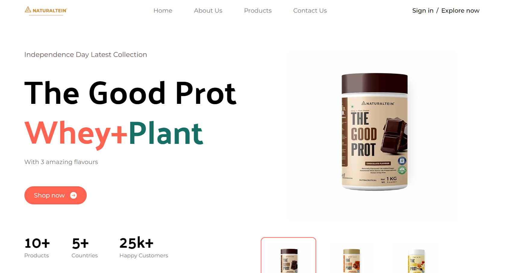
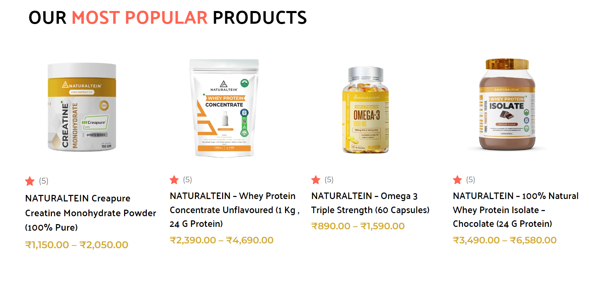
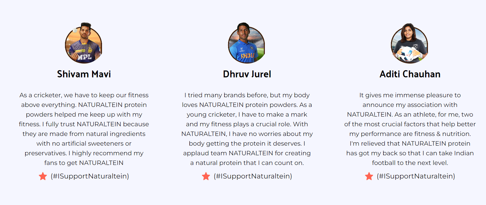
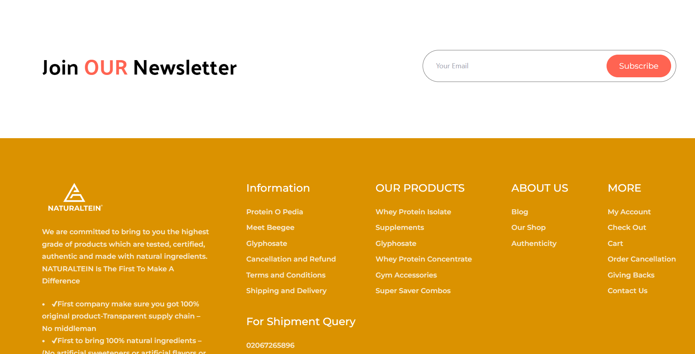
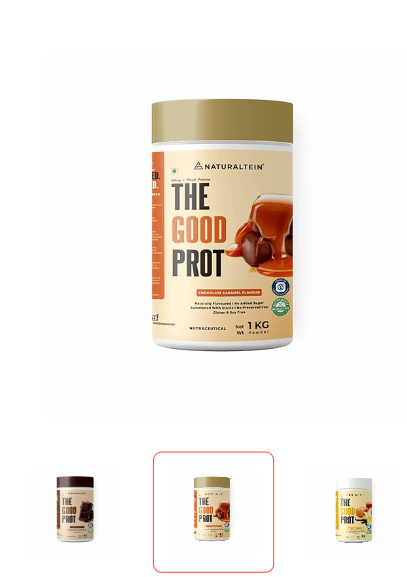
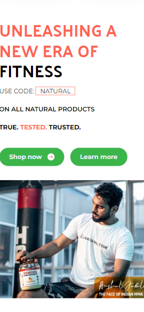

# Supplement Store 

## Description

This project is a static landing page built using React and styled with Tailwind CSS. It serves as an elegant and informative web presence, perfect for showcasing products, services, or personal portfolios.

## Live URL

You can explore the live version of the project [here](https://eshans-pro-store.netlify.app/).

## Screenshots

### Desktop View 










### Mobile View 



--------------------------------

------------------------------

## Technologies Used

 
 
 

 
 
 

    

## Responsive Design

The landing page is designed to be fully responsive, ensuring a seamless user experience on various devices and screen sizes.

## UI Features

- Clean and modern user interface
- Engaging and visually appealing design

## Installation

Provide instructions on how to install and run your project locally. You can include any dependencies, environment setup, or configuration steps.

```bash
# Clone the repository
git clone https://github.com/eshan-one/Supplement-Store-.git

# Change into the project directory
cd Supplement-Store

# Install dependencies
npm install

# Start the development server
npm start


## License

This project is licensed under the MIT License. See the [LICENSE](LICENSE) file for details.
